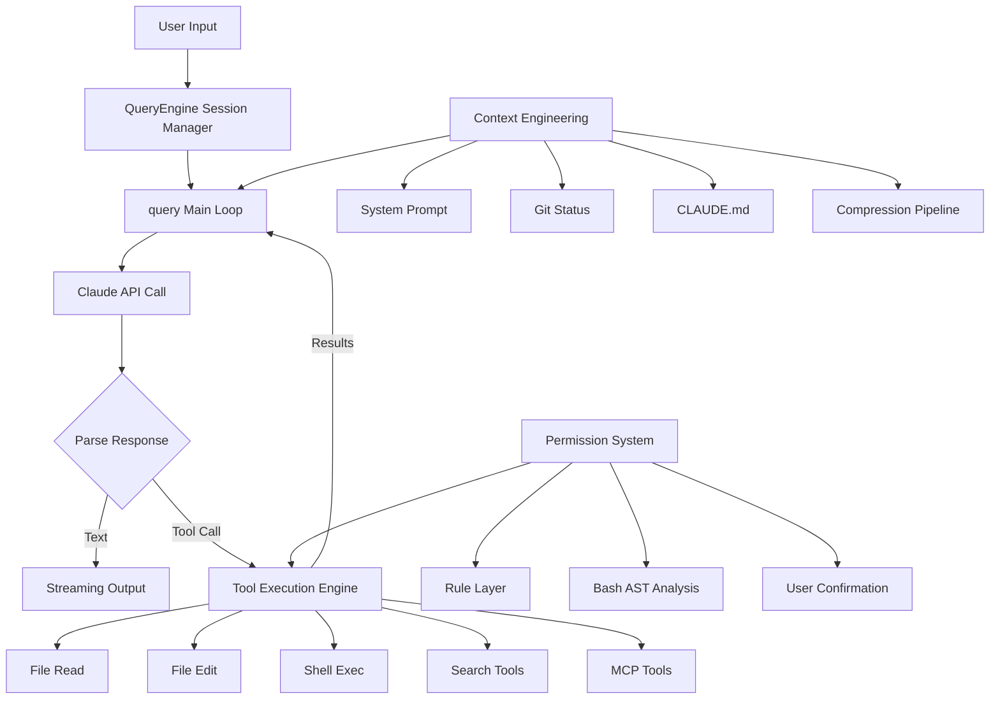

# How Claude Code Works

> **Educational architecture analysis of Claude Code — an Agentic Coding System study**

  <a href="https://windy3f3f3f3f.github.io/how-claude-code-works/#/en/"><strong>📘 Read Online</strong></a>
  &nbsp;&nbsp;|&nbsp;&nbsp;
  <a href="./README.md">中文</a>

> 🛠️ **Want to build one yourself?** Companion project **[Claude Code From Scratch](https://github.com/Windy3f3f3f3f/claude-code-from-scratch)** — ~4300 lines (TypeScript & Python), 13-chapter tutorial, a clean-room educational Coding Agent inspired by Claude Code

---

> ⚖️ **Disclaimer**: This project is an **educational architecture analysis** aimed at developers. All content is independent research and reasoning — it does **not** represent Anthropic's official design and makes **no guarantee** of alignment with Claude Code's real internal implementation. "Claude Code" is a trademark of Anthropic; this project is not affiliated with Anthropic and does not redistribute any Anthropic source code.

Claude Code is the most widely used AI coding agent today. It understands entire codebases, autonomously executes multi-step programming tasks, and safely runs commands — all powered by engineering wisdom distilled into **500K+ lines of TypeScript source code**.

A community-circulating source snapshot of this 500K-line TypeScript codebase finally let us see — first-hand — what a real, production-grade Coding Agent actually looks like under the hood. **But where do you even start with 500K lines?**

This project is the answer. We've distilled **15 topic-specific documents** covering every critical design decision, from the core agent loop to the security architecture. Whether you want to build your own AI agent or deeply understand how Claude Code works, this is the shortest path.

## System Architecture

## Why is this source code worth studying?

Most AI agent frameworks are "demo-grade" — they work for one scenario and call it done. Claude Code is different. It's a **production system used daily by millions of developers**, tackling problems far more complex than any demo:

- Conversations grow to tens of thousands of tokens — what happens when the context window runs out?
- A user asks the AI to run `rm -rf /` — how do you stop it?
- dozens of built-in tools coexist — how do you coordinate them?
- Network drops, API overloads, token limits hit — how do you avoid crashing?
- How do you make it *feel* fast when model inference alone takes tens of seconds?

The answers are all in the source code.

## Key Designs from the Source Code

> Everything below comes from actual source code analysis, not speculation.

### Why does Claude Code feel so fast?

It does three clever things:

1. **End-to-end streaming** — Instead of waiting for the model to finish thinking, every token is displayed the instant it's generated. The entire pipeline from API call to terminal rendering is streaming.
2. **Tool pre-execution** — When the model says "I need to read this file," that file is already being read. The system parses and executes tool calls while the model is still generating output, hiding ~1s of tool latency within the 5-30s model generation window.
3. **9-phase parallel startup** — Independent initialization tasks run in parallel, compressing the critical path to ~235ms.

### What happens when things go wrong? — Silent recovery

Most programs show errors to users. Claude Code's strategy: **if an error is recoverable, the user never sees it.**

When a conversation exceeds the context window, it doesn't pop up an error dialog — it silently compresses the context and retries. Hit the output token limit? It automatically escalates from 8K to 64K and tries again. The agent loop has 7 different "continue" strategies, each handling a different failure recovery path.

This is why you rarely see errors in Claude Code — not because there aren't any, but because most are handled internally.

### What about long conversations? — 4-level progressive compression

One of the most elegant designs in the entire system. When context approaches its limit, instead of a blunt compression pass, it goes through 4 graduated levels:

1. **Snip** — Truncate large content blocks (old tool outputs) from history
2. **Deduplicate** — Remove duplicate content at near-zero cost
3. **Collapse** — Fold inactive conversation segments without modifying originals (reversible)
4. **Summarize** — Last resort: spawn a child agent to summarize the entire conversation

Each level may free enough space that subsequent levels don't need to run. After compression, the system **automatically restores the 5 most recently edited files**, preventing the model from forgetting what it was just working on.

### How do you prevent AI from executing dangerous operations? — 7 layers of defense

Claude Code runs commands directly on your machine — security has to be rock-solid. It doesn't rely on a single "are you sure?" dialog. Instead, it builds 7 layers of defense:

1. **Workspace trust** — On first entering a directory, it asks you to trust it; if you don't, all of that project's custom Hooks are disabled, blocking scripts pre-planted by malicious repos
2. **Permission modes** — Different trust levels restricting what operations can run
3. **Rule matching** — Pattern-based allow/deny/ask lists
4. **Deep Bash analysis** — The most hardcore layer: uses syntax tree analysis (not regex) to dissect the true intent of shell commands, with 23 static security checks covering command injection, environment variable leaks, special character attacks, and more
5. **Tool-level security** — Each tool carries its own input validation and dedicated safety logic (e.g., the file-edit tool blocks dangerous paths)
6. **Sandbox & isolation** — Process-level sandbox (macOS Seatbelt / Linux namespaces) plus Git Worktree file isolation
7. **User confirmation** — Dangerous operations trigger a confirmation dialog, racing against Hooks and the LLM classifier; a 200ms debounce guards against accidental key presses, and once the user acts, human intent always wins

If any single layer blocks the action, it doesn't execute. Defense in depth.

### How do dozens of tools work together?

All tools — file reading, file writing, shell commands, search, even third-party MCP tools — follow **the same interface specification**. This means:

- Third-party tools go through the exact same execution pipeline as built-in tools, getting identical security checks and permission controls
- Read-only tools automatically run in parallel; write operations are serialized — no manual concurrency management needed
- When tool output exceeds 100K characters, it's automatically saved to disk; the model gets a summary and file path, reading the full content on demand

### How do multiple agents collaborate?

Claude Code supports three multi-agent modes:

- **Sub-agent** — The main agent dispatches tasks to child agents and waits for results
- **Coordinator** — Pure commander mode: the coordinator can only assign tasks, **it cannot read files or write code itself**, enforcing division of labor
- **Swarm** — Named agents communicate peer-to-peer, each working independently

To prevent conflicts from multiple agents editing the same files, the system uses Git Worktrees to give each agent its own isolated copy of the codebase.

## Documentation

### Quick Start
- **[Understand Claude Code in 10 Minutes](./en/docs/quick-start.md)** — Condensed overview of everything

### Deep Dives

| # | Document | What you'll learn |
|---|----------|-------------------|
| 1 | [Overview](./en/docs/01-overview.md) | What problem Claude Code solves, the thinking behind tech choices, overall architecture |
| 2 | [Agent Loop](./en/docs/02-agent-loop.md) | How the agent "think-act-observe" loop works, how it handles interruption and recovery |
| 3 | [Context Engineering](./en/docs/03-context-engineering.md) | How to fit the most useful information into a limited context window, full compression strategy details |
| 4 | [Tool System](./en/docs/04-tool-system.md) | How dozens of tools are registered, dispatched, and concurrency-controlled; how to integrate third-party tools |
| 5 | [Skills System](./en/docs/09-skills-system.md) | 6 skill sources, lazy loading, inline/fork execution, permission model, post-compaction preservation |
| 6 | [Memory System](./en/docs/08-memory-system.md) | 4 memory types, Sonnet semantic recall, background extraction agent, drift defense |
| 7 | [Hooks & Extensibility](./en/docs/06-hooks-extensibility.md) | 23 hook events, how to customize Claude Code's behavior without modifying source code |
| 8 | [Multi-Agent Architecture](./en/docs/07-multi-agent.md) | Sub-agent, Coordinator, and Swarm — design tradeoffs of three multi-agent modes |
| 9 | [Plan Mode](./en/docs/10-plan-mode.md) | Two entry paths, 5-phase workflow, attachment throttling, Phase 4 A/B experiments, plan file management, approval and permission restoration |
| 10 | [Code Editing Strategy](./en/docs/05-code-editing-strategy.md) | Why "search-and-replace" over "full file rewrite," how to ensure edit safety |
| 11 | [Task Management System](./en/docs/15-task-system.md) | File-level storage with concurrency locking, 3-layer change detection, dependency tracking and atomic claiming, multi-agent task coordination, verification nudge |
| 12 | [Permission & Security](./en/docs/11-permission-security.md) | The complete 7-layer security system, 23 Bash security checks |
| 13 | [System Prompt Design](./en/docs/14-system-prompt-design.md) | 7-layer progressive prompt architecture, anti-pattern inoculation, blast radius risk framework, 7 agent prompt design principles |
| 14 | [User Experience](./en/docs/12-user-experience.md) | Why React for terminal UI, streaming output implementation, terminal interaction details |
| 15 | [Minimal Components](./en/docs/13-minimal-components.md) | The minimum modules needed for a coding agent, the evolution path from 500 lines to 500K |
| 16 | [Observability: Metrics & Traces](./en/docs/16-observability.md) | The EXPLAIN of a prompt, three observability planes + transcript substrate, the prompt.id join key, an OTel metric/event/span walkthrough, cost accounting, permission decision logging, privacy boundaries |
| 17 🔍 | [Autonomy & Continuation: `/goal` and `/loop`](./en/docs/17-autonomy-goal-loop.md) | **Post-snapshot · black-box RE**: the two paradigms of autonomy (a gatekeeping evaluator vs a self-scheduling alarm), the `/goal` evaluator's full system prompt and its `impossible` loop-brake, `/loop`'s parsing rules and the cron / ScheduleWakeup execution paths, with a reproducible reverse-engineering method in the appendix |
| 18 🔍 | [Auto Mode: Permissions Enter the Classifier Era](./en/docs/18-auto-mode.md) | **Post-snapshot · source + capture**: permissions evolve from "rules + confirmation dialogs" to an ML classifier adjudicating each action, four natural-language rule buckets, a two-stage (coarse screen → fine judgment) classifier, the reasoning-blind "the accused can't argue its own case", how it understands "don't push", brakes and degradation; with the classifier's full system prompt and a reproducible RE method in the appendix |

## Who should read this?

| You are | What you'll get |
|---------|----------------|
| A developer building AI agent products | A battle-tested architecture reference validated by millions of users |
| A Claude Code user | Understanding of why it works the way it does, and how to deeply customize it with Hooks and CLAUDE.md |
| Someone interested in AI safety | Production-grade AI security design in practice, not just theory from papers |
| A student or AI researcher | First-hand material on large-scale engineering practice, more real than any textbook |

## Key Stats

| Metric | Value |
|--------|-------|
| Source lines | 512,000+ |
| TypeScript files | 1,884 |
| Built-in tools | ~55 (tools.ts registry, incl. feature-gated) |
| Compression levels | 4 |
| Security layers | 7 |

## Reading Recommendations

**Only have 10 minutes?**
→ Read [Quick Start](./en/docs/quick-start.md)

**Want to understand core principles?**
→ Read in order: [Agent Loop](./en/docs/02-agent-loop.md) → [Context Engineering](./en/docs/03-context-engineering.md) → [Tool System](./en/docs/04-tool-system.md)

**Want to build your own AI agent?**
→ Start with [Minimal Components](./en/docs/13-minimal-components.md), then follow **[claude-code-from-scratch](https://github.com/Windy3f3f3f3f/claude-code-from-scratch)** — 13-chapter hands-on tutorial, ~4300 lines of code, every step mapped to the real source

**Want to customize Claude Code?**
→ Read [Hooks & Extensibility](./en/docs/06-hooks-extensibility.md) + [Memory System](./en/docs/08-memory-system.md) + [Skills System](./en/docs/09-skills-system.md)

**Care about security?**
→ Read [Permission & Security](./en/docs/11-permission-security.md) + [Code Editing Strategy](./en/docs/05-code-editing-strategy.md)

## Roadmap / TODO

Our analysis is based on a source snapshot of roughly **v2.1.6x (late March 2026)**. Since then Claude Code has shipped ~130 more releases with major capabilities that don't exist in the snapshot. There is **no leaked source to walk through** for these, so we plan to analyze them differently — **black-box testing + open-source intelligence** (official changelog, official docs, public posts): use the latest builds hands-on, observe behavior, boundaries and failure modes, then cross-check against official material to reason about how they likely work (inference will be clearly separated from evidence).

Planned topics:

- [x] **Observability: Metrics & Trace** (proposed in [#10](https://github.com/Windy3f3f3f3f/how-claude-code-works/issues/10)) — how Claude Code instruments itself: OpenTelemetry metrics/events export, cost accounting, session transcripts as turn-level traces. **Done → [Chapter 16: Observability](./en/docs/16-observability.md)**
- [x] **The autonomy loop: `/goal`, `/loop` and cron scheduling** (v2.1.71 / v2.1.139) — set a completion condition and Claude keeps working across turns until it's met; recurring tasks on fixed or model-chosen intervals. **Done → [Chapter 17: Autonomy & Continuation](./en/docs/17-autonomy-goal-loop.md)** (includes the full prompt text of the `/goal` evaluator and the `/loop` command + a reproducible RE method)
- [ ] **Dynamic Workflows (trigger word "ultracode")** (v2.1.154–160) — an orchestration script that directs tens to hundreds of agents in the background, with token budgets, resumable runs and the `/workflows` panel
- [x] **Auto Mode: permissions enter the classifier era** (opt-in dropped in v2.1.152) — from "rules + confirmation dialogs" to an LLM classifier deciding allow/deny per action, honoring spoken boundaries like "don't push". **Done → [Chapter 18: Auto Mode](./en/docs/18-auto-mode.md)** (includes the classifier's full system prompt + the four rule buckets + a reproducible RE method)
- [ ] **The background agent fleet** (v2.1.139–198) — `/bg`, a resident daemon, the global `claude agents` view, retire→wake lifecycle, auto commit+push+draft-PR on completion, subagents running in the background by default
- [ ] **Cloud multi-agent review** (v2.1.111–147) — `/ultrareview` → `/code-review`: parallel multi-agent analysis with adversarial critique, effort levels (low→ultra) and CI integration
- [ ] **Agent Teams & cross-session security** (v2.1.166–178) — team collaboration via `SendMessage`; the anti-prompt-injection design where cross-session messages carry no user authority

> Vote or suggest topics in [issues](https://github.com/Windy3f3f3f3f/how-claude-code-works/issues).

## Contributors

|  |  |  |  |
|:---:|:---:|:---:|:---:|
| [@Windy3f3f3f3f](https://github.com/Windy3f3f3f3f) | [@davidweidawang](https://github.com/davidweidawang) | [Kaibo Huang](https://scholar.google.com/citations?user=C7B5X5IAAAAJ&hl=zh-CN) | [@longx24](https://github.com/longx24) |

## Contributing

Issues and PRs welcome! If you find an error in the analysis or have a better perspective, we'd love to discuss.

## Changelog

| Date | Changes |
|------|---------|
| 2026-04-09 | Comprehensive review and fix of all 13 chapters: corrected inaccurate numbers/references (line counts, percentages, event counts, chapter numbering), added high-level overviews to chapters that lacked them, restructured sections for better readability (ch05 split/swap, ch08 reorder/merge), synchronized Chinese and English versions |
| 2026-04-03 | Added Chapter 14: System Prompt Design Philosophy, in-depth analysis of prompt content design principles and engineering practices |
| 2026-04-03 | Added dark mode, reading progress bar, back-to-top button, context-aware language switching, and other UI improvements |
| 2026-04-03 | Completed English translations for all 13 documents, supporting bilingual Chinese-English switching |
| 2026-04-01 | Split Memory & Skills into separate chapters (11→12 articles), renumbered 01-12 by sidebar grouping |
| 2026-04-01 | Major expansion of all 12 chapters (doubled in length), added source-level implementation details, Mermaid architecture diagrams, and code examples |
| 2026-03-31 | Added 3 chapters: Hooks & Extensibility, Multi-Agent Architecture, Memory & Skills System |
| 2026-03-31 | Launched Docsify documentation site with search, Mermaid rendering, and chapter navigation |
| 2026-03-31 | Initial release: 8 core architecture analysis documents |

## License

MIT
