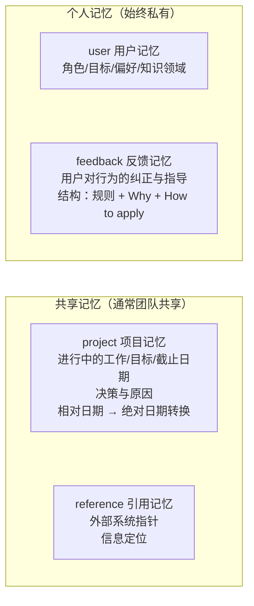
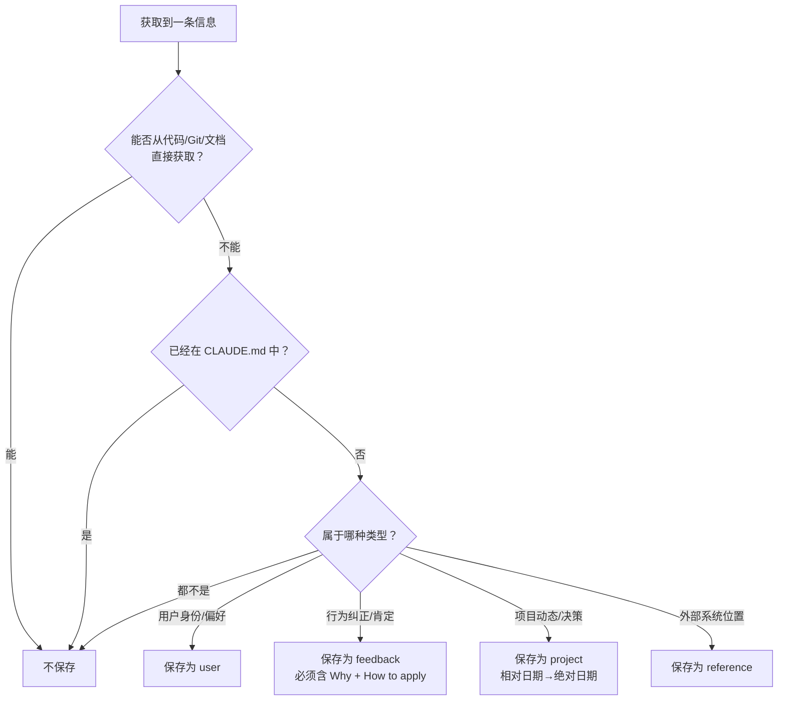
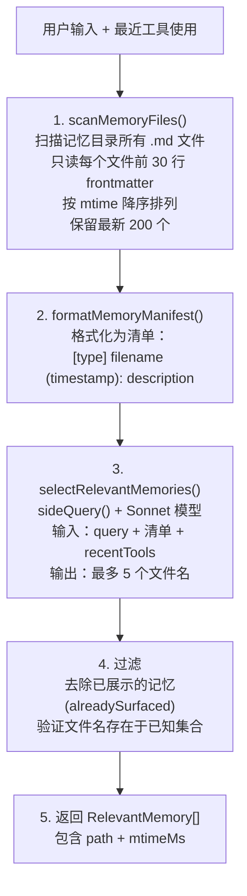
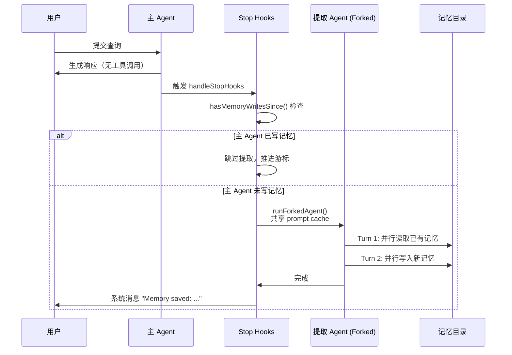
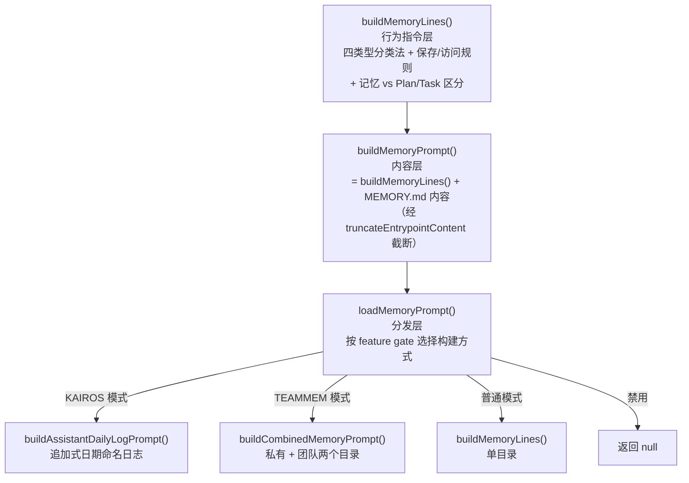

# 第 6 章：记忆系统

> 没有记忆的 Agent 每次对话都是初见——记忆让 Claude Code 从"无状态工具"进化为"跨会话学习的编程伙伴"。

## 6.1 为什么 Agent 需要记忆？

想象这样的场景：你连续三天和 Claude Code 在同一个项目上协作。第一天你告诉它"不要在响应末尾总结"，第二天你又说了一遍，第三天你开始烦躁——为什么它记不住？

这就是没有记忆的 Agent 的根本问题：**每次会话都从零开始**。用户偏好丢失、项目上下文重置、之前的纠正被遗忘。

Claude Code 的记忆系统解决这个问题，但它不是一个简单的"把所有信息存下来"的系统。它有一个核心约束：

> 只记忆不可从当前项目状态推导的信息。

省存储空间不是重点，这个约束真正要防的是记忆与现实漂移。如果记忆记录了"认证模块在 `src/auth/`"，一次代码重构就会让这条记忆变成误导。代码模式、架构、git 历史这些信息都是自描述的——从代码本身读取，永远比从记忆里回忆更准确。

### 记忆 vs CLAUDE.md：互补而非竞争

| 维度 | CLAUDE.md | 记忆系统 |
|------|-----------|---------|
| 性质 | 静态配置文件 | 动态知识库 |
| 维护方式 | 用户手动编辑，签入 Git | Agent 自动写入或 `/remember` |
| 作用范围 | 团队共享（项目级）或用户全局 | 个人私有（可选团队共享） |
| 内容类型 | 项目规范、编码约定、CI 配置 | 用户偏好、行为纠正、项目动态 |
| 加载方式 | 每次会话完整加载 | 索引预加载 + 语义召回按需加载 |

两者互补：CLAUDE.md 存"项目是什么"，记忆存"和这个人协作时要注意什么"。

关键文件：`src/memdir/`

## 6.2 四种记忆类型：封闭分类法

记忆系统用一套封闭的四类型分类法（closed taxonomy），每种类型有明确的职责边界和结构要求：



| 类型 | 记什么 | 示例 | 触发时机 |
|------|--------|------|---------|
| **user** | 用户身份、偏好、知识背景 | "用户是数据科学家，专注可观测性" | 了解到用户角色/偏好时 |
| **feedback** | 对 Agent 行为的纠正 | "不要在响应末尾总结，用户能自己看 diff" | 用户纠正行为时（"不要..."、"别再..."） |
| **project** | 项目进展、决策、截止日期 | "2026-03-05 合并冻结，移动端发布" | 了解到谁在做什么、为什么、截止日期时 |
| **reference** | 外部系统的定位信息 | "管道 Bug 追踪在 Linear INGEST 项目" | 了解到外部系统中信息位置时 |

封闭分类法逼 Agent 把每条记忆归进明确的语义类别；换成自由标签，标签会越堆越多，召回时匹配含糊。每种类型有各自的保存结构和使用方式，模型写入、读取时都有明确的行为指引。

### feedback 类型深度分析：不只记录失败

源码 `memoryTypes.ts` 中 feedback 类型的定义揭示了一个微妙的设计决策——feedback 不仅记录用户的纠正，还记录用户的肯定：

```
Guidance the user has given you about how to approach work — both what to
avoid and what to keep doing. These are a very important type of memory to
read and write as they allow you to remain coherent and responsive to the
way you should approach work in the project.
```

成功和失败都要记，源码注释里给了理由（意译）：

> 如果你只保存纠正，你会避免过去的错误，但会偏离用户已经验证过的好方法，并可能变得过于谨慎。

假设用户说"这次的代码风格很好，以后就这样写"，如果不记录这个正面反馈，Agent 下次会话可能又去"改进"代码风格——结果反而偏离了用户满意的方向。

### feedback 和 project 的结构化要求

这两种类型要求特定的正文结构：

```markdown
规则或事实本身。

**Why:** 用户给出这个反馈的原因——通常是一个过去的事故或强烈偏好。
**How to apply:** 什么时候/在哪里应用这条指导。
```

记下 Why，模型遇到边界情况才能自己判断，不至于死守规则。源码提示词的原话是："Knowing *why* lets you judge edge cases instead of blindly following the rule."

举个例子：如果记忆只记录"不要 mock 数据库"，Agent 会在所有测试中避免 mock。但如果记忆还包含"Why: 上季度 mock 测试通过但生产环境迁移失败"，Agent 就能判断——这条规则适用于集成测试，单元测试中的轻量级 mock 可能没问题。

### project 类型：相对日期 → 绝对日期

project 类型有一个特殊要求：必须把相对日期转换成绝对日期。

当用户说"周四之后合并冻结"，记忆必须存成"2026-03-05 后合并冻结"。因为这条记忆可能几周后才被另一次会话读到，那时"周四"早已没有意义。

### 什么不该保存

记忆系统有一个明确的排除列表，来自源码中的 `WHAT_NOT_TO_SAVE_SECTION`：

```
- 代码模式、约定、架构、文件路径、项目结构——读当前代码即可获得
- Git 历史、最近的改动、谁改了什么——git log / git blame 是权威来源
- 调试方案或修复步骤——修复在代码里，上下文在 commit 消息中
- 已经记录在 CLAUDE.md 中的内容
- 临时任务细节：进行中的工作、临时状态、当前对话上下文
```

这些排除规则即使用户明确要求保存也照样生效。如果用户说"记住这个 PR 列表"，Agent 应该反过来引导用户想："这个列表里，有哪些是推导不出来的？是关于它的某个决策、某个意外发现，还是某个截止日期？"

### 记忆决策流程



## 6.3 存储架构

### 目录结构

记忆文件存储在项目特定目录中：

```
~/.claude/projects/{project-hash}/memory/
├── MEMORY.md              ← 索引文件（每次会话自动加载）
├── user_role.md            ← 用户记忆
├── feedback_terse.md       ← 反馈记忆
├── project_freeze.md       ← 项目记忆
└── reference_linear.md     ← 引用记忆
```

### 路径解析：三级优先

记忆目录的位置通过三级优先级链确定（`src/memdir/paths.ts`）：

| 优先级 | 来源 | 用途 |
|--------|------|------|
| 1 | `CLAUDE_COWORK_MEMORY_PATH_OVERRIDE` 环境变量 | Cowork/SDK 集成，完全绕过标准路径 |
| 2 | `autoMemoryDirectory` in settings.json | 用户自定义记忆存储位置（支持 `~/` 展开） |
| 3 | `~/.claude/projects/{sanitized-git-root}/memory/` | 默认路径 |

这条链唯独排除 projectSettings，是出于安全考虑。`getAutoMemPathSetting()` 从 policy / flag / local / user 四个可信来源按序读取，就是不读 projectSettings——因为它来自项目的 `.claude/settings.json`，会被签入代码仓库。一个恶意仓库可以设置 `autoMemoryDirectory: "~/.ssh"`，让 Claude Code 的记忆写入操作（Edit/Write 工具）拿到对用户 SSH 密钥目录的写权限。这跟权限系统里"安全敏感路径不信任项目级设置"的原则一致。

### 存储格式

每条记忆是独立的 Markdown 文件，带 YAML frontmatter：

```markdown
---
name: 简洁回复偏好
description: 用户不希望在响应末尾看到总结
type: feedback
---

不要在每次响应末尾总结已完成的操作。

**Why:** 用户明确表示可以自己阅读 diff。
**How to apply:** 所有响应保持简洁，省略尾部总结。
```

`description` 字段不只是元数据，更是召回系统的主要依据：Sonnet 模型选记忆时，主要靠它判断相关性，所以 description 必须足够具体——"用户偏好"太泛，"用户不希望在响应末尾看到总结"才够精确。

### Git Worktree 共享

`findCanonicalGitRoot()` 确保同一仓库的所有 Git worktree 共享同一个记忆目录。如果不这样做，`git worktree add` 创建的新工作目录会生成一个独立的记忆空间，导致记忆"孤岛化"——在主工作目录中保存的偏好在 worktree 中消失。

### 目录预创建：避免浪费模型回合

系统通过 `ensureMemoryDirExists()` 在会话开始时保证目录存在。这一步是幂等的——底层的 `fs.mkdir` 自动处理 `EEXIST`，整个路径链在一次调用中创建。

预创建目录是为了省掉模型的无用功。实践中发现，Claude 会浪费回合执行 `ls` / `mkdir -p` 去检查目录在不在。系统提示词里会注入 `DIR_EXISTS_GUIDANCE`，明确告诉模型：

> "This directory already exists — write to it directly with the Write tool (do not run mkdir or check for its existence)."

这是一个典型的"用系统设计消除模型低效行为"的例子——与其期望模型学会不检查目录，不如直接预创建并明确告知。

### 是否启用记忆：五级优先

`isAutoMemoryEnabled()` 的判断链：

```
CLAUDE_CODE_DISABLE_AUTO_MEMORY 环境变量  →  禁用
--bare 启动标志                           →  禁用
远程模式（无持久化存储）                    →  禁用
settings.json 中 autoMemoryEnabled       →  按配置
以上都不满足                              →  默认启用
```

## 6.4 MEMORY.md：索引而非容器

`MEMORY.md` 是记忆系统的入口点（entrypoint），扮演两个角色：

1. 索引：列出所有可用的记忆文件和简短描述，供模型快速定位相关记忆
2. 快速检查：每次会话启动时，MEMORY.md 的内容会通过 `getClaudeMds()` 自动加载到用户上下文中（与 CLAUDE.md 同一批次加载），让模型在第一个回合就知道有哪些记忆可用

正因为 MEMORY.md 每次会话都完整加载，它必须保持紧凑——它是索引，不是记忆容器。每个条目应为一行链接：

```markdown
- [用户角色](user_role.md) — 数据科学家，专注可观测性
- [简洁回复偏好](feedback_terse.md) — 不要尾部总结
- [合并冻结](project_freeze.md) — 2026-03-05 移动端发布冻结
- [Bug 追踪](reference_linear.md) — 管道 Bug 在 Linear INGEST 项目
```

用数据库打个比方：MEMORY.md 是索引，记忆文件是数据行。索引必须紧凑，因为它每次会话都完整加载进系统提示词，大小直接挤占有效上下文空间。真正的记忆内容只有被 Sonnet 选中时才按需读取。

### 双层截断机制

MEMORY.md 有严格的大小限制，由 `truncateEntrypointContent()` 实现：

```typescript
// src/memdir/memdir.ts
export const MAX_ENTRYPOINT_LINES = 200
export const MAX_ENTRYPOINT_BYTES = 25_000  // ~125 chars/line at 200 lines

export function truncateEntrypointContent(raw: string): EntrypointTruncation {
  const contentLines = trimmed.split('\n')
  const wasLineTruncated = lineCount > MAX_ENTRYPOINT_LINES
  const wasByteTruncated = byteCount > MAX_ENTRYPOINT_BYTES

  // 第一步：按行截断（自然边界）
  let truncated = wasLineTruncated
    ? contentLines.slice(0, MAX_ENTRYPOINT_LINES).join('\n')
    : trimmed

  // 第二步：如果仍超过字节上限，在最后一个换行处截断（不切断行中间）
  if (truncated.length > MAX_ENTRYPOINT_BYTES) {
    const cutAt = truncated.lastIndexOf('\n', MAX_ENTRYPOINT_BYTES)
    truncated = truncated.slice(0, cutAt > 0 ? cutAt : MAX_ENTRYPOINT_BYTES)
  }

  // 追加警告信息
  return {
    content: truncated + `\n\n> WARNING: MEMORY.md is ${reason}. Only part of it was loaded.`,
    lineCount, byteCount, wasLineTruncated, wasByteTruncated,
  }
}
```

两层截断各防一种情况：

- 行截断（200 行）：正常情况——索引条目太多，按行截断能保住完整条目。
- 字节截断（25KB）：防御措施——捕捉行数在 200 以内、但单行极长的异常索引。实际观察到 p100 场景：有人把整篇文档塞成单行条目，197KB 却仍在 200 行内。

返回的元数据（`wasLineTruncated` / `wasByteTruncated`）用于遥测追踪，帮助团队了解用户的索引增长模式。

截断时追加的警告不只报告问题，还教模型怎么修复——它提示"keep index entries to one line under ~200 chars; move detail into topic files"。这体现一个设计原则：错误消息应该带上修复指引。

### skipIndex 模式

一个实验性的 feature gate（`tengu_moth_copse`）正在测试移除 MEMORY.md 索引要求。启用后，记忆提取 Agent 直接写记忆文件而不更新 MEMORY.md。

测试它，是因为两步保存流程（写文件、再更新索引）是记忆系统里最容易出错的一环——模型可能写了文件却忘了更新索引，或者把索引格式写错。如果 skipIndex 模式的召回质量不掉——`scanMemoryFiles()` 本来就直接扫描目录、不依赖索引——整个保存流程就能简化。

## 6.5 记忆召回：语义检索

当用户提交查询时，系统自动寻找相关记忆。这个过程分为扫描、评估、过滤三个阶段：



### scanMemoryFiles()：单次遍历优化

`src/memdir/memoryScan.ts` 里的扫描做了一处提速：单次遍历（read-then-sort），取代传统的 stat-sort-read 两步法：

```typescript
export async function scanMemoryFiles(memoryDir: string, signal: AbortSignal) {
  const entries = await readdir(memoryDir, { recursive: true })
  const mdFiles = entries.filter(f => f.endsWith('.md') && basename(f) !== 'MEMORY.md')

  // 并行读取所有文件的 frontmatter（只读前 30 行）
  const headerResults = await Promise.allSettled(
    mdFiles.map(async (relativePath) => {
      const { content, mtimeMs } = await readFileInRange(filePath, 0, FRONTMATTER_MAX_LINES)
      const { frontmatter } = parseFrontmatter(content, filePath)
      return { filename: relativePath, filePath, mtimeMs, description, type }
    })
  )

  // 单次遍历：读取后排序，而非 stat-排序-读取
  return headerResults
    .filter(r => r.status === 'fulfilled')
    .map(r => r.value)
    .sort((a, b) => b.mtimeMs - a.mtimeMs)
    .slice(0, MAX_MEMORY_FILES)  // 保留最新 200 个（MAX_MEMORY_FILES = 200）
}
```

注意 `MAX_MEMORY_FILES = 200` 不是扫描上限，而是返回结果数的限制。`readdir` 会读取目录中所有 `.md` 文件，每个都读取 frontmatter 并获取 mtime，然后按修改时间降序排列，最后 `.slice(0, 200)` 只保留最新的 200 个。如果记忆目录里有 500 个文件，500 个都会被扫描，但只有最新的 200 个进入后续的语义召回。

两种方法一比，就知道快在哪。

传统方法是：
1. `stat()` 所有文件获取 mtime → N 次 syscall
2. 按 mtime 排序，取前 200
3. `read()` 前 200 个文件的 frontmatter → 200 次 syscall
4. 总计：N + 200 次 syscall

单次遍历方法是：
1. `read()` 所有文件的前 30 行（`readFileInRange` 同时返回 mtime）→ N 次 syscall
2. 排序并保留最新 200 个
3. 总计：N 次 syscall

对常见场景（N ≤ 200），syscall 数量减半。代价是多读了一些最终被丢弃的文件的 frontmatter，但每个文件只读 30 行，开销极小。

`FRONTMATTER_MAX_LINES = 30` 只读前 30 行，是因为 frontmatter 始终在文件顶部。读整个文件对召回是浪费——选择阶段只用得上 description 字段。

### formatMemoryManifest()：清单格式

扫描结果被格式化为清单，提供给 Sonnet 评估：

```
- [feedback] feedback_terse.md (2026-03-28T10:30:00Z): 用户不希望在响应末尾看到总结
- [project] project_freeze.md (2026-03-01T09:00:00Z): 2026-03-05 合并冻结，移动端发布
```

格式里的 ISO 时间戳很要紧——它让 Sonnet 能判断记忆的新鲜度。一个月前的"合并冻结"记忆很可能已经过时，Sonnet 可以据此调低它的优先级。

### selectRelevantMemories()：Sonnet 语义评估

```typescript
const SELECT_MEMORIES_SYSTEM_PROMPT = `You are selecting memories that will be useful
to Claude Code as it processes a user's query. Return a list of filenames for the
memories that will clearly be useful (up to 5).
- Be selective and discerning.
- If recently-used tools are provided, do not select usage reference docs for those
  tools. DO still select warnings, gotchas, or known issues about those tools.`

const result = await sideQuery({
  model: getDefaultSonnetModel(),
  system: SELECT_MEMORIES_SYSTEM_PROMPT,
  messages: [{ role: 'user', content: `Query: ${query}\n\nAvailable memories:\n${manifest}${toolsSection}` }],
  max_tokens: 256,
  output_format: { type: 'json_schema', schema: { /* selected_memories: string[] */ } },
})
```

这里用 Sonnet 做语义评估，比关键词匹配更准。比如用户问"部署流程"，关键词匹配可能错过标题为"CI/CD 注意事项"的记忆，Sonnet 却能理解两者的语义关联。

限制 5 个，是因为上下文空间有限：记忆内容作为 user message 注入对话，太多会挤占工作空间。5 个是召回价值和上下文成本之间的平衡点。

### recentTools 参数：精确的噪声过滤

`recentTools` 参数解决一个很具体的问题。当 Claude Code 正在使用某个工具（如 `mcp__X__spawn`）时：

- 该工具的参考文档型记忆是噪声——对话里已经包含了用法
- 但关于它的警告和已知问题仍然有价值

提示词中明确区分这两种情况："do not select usage reference docs for those tools. DO still select warnings, gotchas, or known issues about those tools." 这让选择器在工具使用的上下文中做出更精确的判断。

### alreadySurfaced 预过滤

`findRelevantMemories()` 在调用 Sonnet 之前，就先过滤掉已展示的记忆路径。这不是为了避免重复展示（虽然也有这个效果），而是为了不浪费 5 个召回槽位——如果不预过滤，Sonnet 可能选中 3 个已展示的记忆，只剩 2 个位置留给新记忆。

### 异步预取：不阻塞主循环

记忆召回通过 `pendingMemoryPrefetch` 做异步预取——模型开始生成响应的同时，后台用 `sideQuery()` 查询 Sonnet。等模型真的需要记忆时，结果通常已经就绪。

这个设计确保记忆召回的延迟（一次 Sonnet `sideQuery` 的往返）不叠加到用户感知的响应时间上。对用户来说，记忆召回是"免费"的。

## 6.6 记忆新鲜度与漂移防御

记忆记录的是写入那一刻的事实，但时间会让它过时。记忆系统用多层防御来处理这个问题。

### 人类可读的时间距离

`memoryAge.ts` 将 mtime 转为人类可读的字符串：

```
0 天 → "today"
1 天 → "yesterday"
47 天 → "47 days ago"
```

不用 ISO 时间戳，是因为模型不擅长日期算术。给它 `2026-02-12T10:30:00Z`、再告诉它今天是 `2026-04-01`，它多半算不清中间隔了多少天。而 "47 days ago" 会直接触发模型"这可能过时了"的推理。

### 新鲜度警告

对于超过 1 天的记忆，系统注入新鲜度警告文本（`memoryFreshnessText`）：

> "Memories are point-in-time observations, not live state — claims about code behavior or file:line citations may be outdated."

这个警告的出发点是：用户报告过 Agent 将过时的记忆（如"X 函数在 line 42"）作为事实断言，导致错误的代码修改。

### 记忆访问三规则

源码中的 `WHEN_TO_ACCESS_SECTION` 定义了三条访问规则：

1. 已知记忆与任务相关时：主动查阅
2. 用户明确要求时：必须访问记忆（源码用 MUST 强调）
3. 用户说"忽略记忆"时：视为记忆不存在

第三条规则背后有一个 eval 失败案例：用户说"忽略关于 X 的记忆"，Claude 却回了一句"记忆里说是 Y，但其实……"——等于承认了记忆的存在，还想去"修正"它，违背用户的意图。

### 信任召回：验证而非盲信

`TRUSTING_RECALL_SECTION` 是记忆系统里一道关键的安全网：

> "记忆说 X 存在" ≠ "X 现在存在"

规则要求：如果记忆提到一个文件路径，用 Glob/Read 验证它是否存在。如果记忆提到一个函数，用 Grep 确认它是否还在。

这个节的效果在 eval 里得到验证：没有它，通过率 0/2；加入后，3/3。这说明模型默认会信任记忆里的具体引用，但记忆中的代码位置信息衰减很快——一次重构就可能全部失效。

## 6.7 后台记忆提取

除了模型主动写入、用户通过 `/remember` 保存，Claude Code 还有一个后台记忆提取 Agent（`src/services/extractMemories/extractMemories.ts`），在每次对话回合结束后自动运行。

### 整体架构



### 触发、互斥与重叠防护

提取 Agent 的运行受三层控制，确保既不遗漏也不重复：

1. 触发时机：提取 Agent 在 `handleStopHooks` 里被触发——也就是主 Agent 完成响应、没有更多工具调用的时候。

2. 频率控制：不是每次回合结束都提取，这里有两道过滤：
- 互斥检查：`hasMemoryWritesSince()` 检查主 Agent 是否在最近的消息范围内已经写过记忆文件。如果主 Agent 已经主动保存了记忆（比如用户说"记住这个"，主 Agent 直接调用 Write 写入），提取 Agent 就跳过，免得对同一段对话生成重复记忆。
- 回合节流：`turnsSinceLastExtraction` 计数器控制提取频率。很多回合（比如简单问答）没有值得记忆的信息，不必每次都提取。

3. 并发防护：如果上一次提取还在跑、新的回合又结束了，系统不会启动并发提取，而是通过 `pendingContext` 暂存加 trailing run 机制处理：

```
inProgress = true → 将新请求暂存为 pendingContext（后到的覆盖先到的）
当前提取完成    → 检查 pendingContext，如果有则启动 trailing run
trailing run    → 只处理自游标推进后的新消息
```

这个设计保证两件事。其一，不会有两个提取 Agent 同时写入记忆目录，避免写冲突；其二，不会遗漏任何对话内容——即使提取来不及处理，最新的上下文也会被暂存，等当前提取结束立即处理。

### 工具权限：严格的写入白名单

提取 Agent 的工具权限由 `createAutoMemCanUseTool()` 定义：

| 工具 | 权限 |
|------|------|
| Read / Grep / Glob | 无限制——需要读取已有记忆和代码 |
| Bash | 只读命令（ls, find, grep, cat, stat, wc, head, tail）|
| Edit / Write | **仅限记忆目录内**（通过 `isAutoMemPath()` 校验）|
| 其他所有工具 | 拒绝 |

这是最小权限原则的体现——提取 Agent 只需要读对话上下文和已有记忆，再写入新记忆。它不需要执行代码、改项目文件，也不调用外部服务。

### 提取提示词设计

提取 Agent 的提示词（`src/services/extractMemories/prompts.ts`）有几个关键设计：

回合预算上，提示词明确规定执行策略——"Turn 1: 并行发起所有读取；Turn 2: 并行发起所有写入"。这样把工具调用的并行度拉满，通常 2 个回合就能干完，硬上限是 5 个回合。

为了防止重复，提示词会注入已有记忆的清单（manifest），要求 Agent "先检查是否已有类似记忆，再决定要不要新建"。

还有范围限制：`MUST only use content from last ~${newMessageCount} messages`——只从最新的消息里提取，不重新处理已经处理过的历史。

### 共享 Prompt Cache

提取 Agent 通过 `runForkedAgent()` 创建，跟技能系统的 fork 模式共用同一套底层机制。关键优势是共享父级的 prompt cache——系统提示词不必重新计算、重新传输，提取时省下的正是这部分 token。

## 6.8 记忆提示词构建层级

记忆系统的提示词构建分为三个层级，每层叠加不同的内容：



### buildMemoryLines()：行为指令的八个子节

`buildMemoryLines()` 构建的指令包含八个子节：

1. 持久化记忆介绍：告知模型记忆目录路径，`DIR_EXISTS_GUIDANCE` 说明目录已存在
2. 显式保存/遗忘：用户说"记住"就立即保存，说"忘记"就查找并删除
3. 四类型分类法：user / feedback / project / reference 的完整定义、示例、保存时机
4. 什么不该保存：代码模式、git 历史、CLAUDE.md 已有内容等排除列表
5. 如何保存：默认两步——写文件再更新 MEMORY.md；skipIndex 模式下只写文件一步
6. 何时访问：三条规则加"用户说忽略则忽略"
7. 信任召回：验证记忆中的引用，不盲信
8. 记忆 vs 其他持久化：Plan 用于对齐实施方案，Task 用于追踪当前会话进度，记忆用于跨会话信息

第 8 点的区分特别重要——模型容易混淆何时用记忆、何时用 Plan、何时用 Task。记忆系统的提示词明确划定了边界：

> - Plan：非平凡实现任务的方案对齐，变更应更新 Plan 而非保存记忆
> - Task：当前会话中的步骤分解和进度追踪
> - 记忆：跨会话有价值的信息

### KAIROS 模式

KAIROS 是一个实验性的"助手模式"，为长期运行的会话设计。跟普通模式维护 MEMORY.md 实时索引不同，KAIROS 模式把信息追加到按日期命名的日志文件里：

```
~/.claude/projects/{hash}/logs/
└── 2026/
    └── 04/
        └── 2026-04-01.md    ← 今天的日志
```

每天的日志是追加式的，省去了频繁更新 MEMORY.md 索引的开销。日志定期通过 `/dream` 技能蒸馏成结构化的主题记忆文件。这种"先追加、后整理"的方式适合高频交互场景。

## 6.9 团队记忆

当启用团队记忆（`TEAMMEM` feature gate）时，系统管理两个记忆目录：

```
~/.claude/projects/{hash}/memory/          ← 私有记忆（仅自己可见）
~/.claude/projects/{hash}/memory/team/     ← 团队记忆（项目成员共享）
```

### 作用域指导

在团队模式下，类型分类法增加了 `<scope>` 标签来指导记忆的存储位置：

| 类型 | 默认作用域 | 原因 |
|------|-----------|------|
| **user** | 始终私有 | 个人偏好不应强加给团队 |
| **feedback** | 偏向私有，项目约定可团队共享 | "不要总结"是个人偏好；"测试必须用真实数据库"是团队约定 |
| **project** | 偏向团队 | 里程碑、决策对所有成员有价值 |
| **reference** | 偏向团队 | 外部系统位置是共享知识 |

敏感数据是重点防护对象：团队记忆的提示词明确要求"MUST NOT save sensitive data (API keys, credentials) in team memories"。私有记忆也不建议存敏感信息，团队记忆里更是强制要求——因为它会被其他成员的 Agent 读到。

架构上，`isTeamMemoryEnabled()` 要求先启用自动记忆。团队目录是自动记忆目录的子目录——`mkdir(teamDir)` 递归创建时会顺带把父目录建好。两个目录各有独立的 MEMORY.md 索引，都加载进系统提示词。

## 6.10 Agent 记忆

除了主 Agent 的记忆系统，Claude Code 还为通过 Agent 工具创建的子 Agent 准备了一套独立的记忆系统（`src/tools/AgentTool/agentMemory.ts`）。

### 三个作用域

```
user 作用域:    ~/.claude/agent-memory/{agentType}/
project 作用域: .claude/agent-memory/{agentType}/
local 作用域:   .claude/agent-memory-local/{agentType}/
```

- user：跨所有项目的 Agent 级知识（如"这种类型的探索 Agent 应该如何工作"）
- project：项目特定的 Agent 知识（如"这个项目的测试 Agent 应该用哪个测试框架"）
- local：只针对本地机器，不会签入版本控制

### 为什么与主记忆分离？

子 Agent 的知识类型与主 Agent 不同。一个 "explorer" Agent 学到的代码导航技巧、一个 "test-runner" Agent 学到的测试模式——这些是 Agent 类型特有的操作知识，与用户偏好和项目决策没有关系。分离存储避免了主记忆被 Agent 操作细节污染。

`agentType` 在路径中的作用是隔离不同类型 Agent 的知识空间。路径中的冒号被替换为破折号（`sanitizeAgentTypeForPath()`）以兼容文件系统。

### 记忆注入方式

Agent 记忆通过与主记忆相同的 `buildMemoryPrompt()` 函数构建，但带有 Agent 特有的行为指导。注入方式也相同——MEMORY.md 索引进系统提示词，具体记忆按需通过语义召回加载。

## 6.11 记忆注入对话的方式

记忆通过两条路径到达模型的上下文窗口：MEMORY.md 走系统提示词，每次会话必加载；召回的记忆走用户消息，按需注入。看懂这两条路径，才能算清记忆系统到底占了多少上下文。

### MEMORY.md：用户上下文注入

MEMORY.md 的内容通过 `getMemoryFiles()` → `getClaudeMds()` 流程加载，与 CLAUDE.md 走同一条路径，最终作为用户上下文（`getUserContext()`）的一部分注入。系统提示词中还有一段独立的记忆行为指令，通过 `systemPromptSection('memory', () => loadMemoryPrompt())` 注入，包含四类型分类法、保存规则等。

这意味着：

- 每次会话自动加载，无需模型主动请求
- MEMORY.md 内容经过 `truncateEntrypointContent()` 截断（200 行 / 25KB）
- 行为指令位于系统提示词中，MEMORY.md 内容位于用户上下文中

实际注入到上下文中的 MEMORY.md 内容大致如下：

```
Contents of ~/.claude/projects/a1b2c3d4/memory/MEMORY.md (user's auto-memory, persists across conversations):

- [用户角色](user_role.md) — 数据科学家，专注可观测性
- [简洁回复偏好](feedback_terse.md) — 不要尾部总结
- [合并冻结](project_freeze.md) — 2026-03-05 移动端发布冻结
- [Bug 追踪](reference_linear.md) — 管道 Bug 在 Linear INGEST 项目
```

这段文本由 `getClaudeMds()` 拼接生成（`src/utils/claudemd.ts`），格式为 `Contents of {path}{description}:\n\n{content}`。`description` 部分根据文件类型不同而变化——MEMORY.md 对应的是 `(user's auto-memory, persists across conversations)`。

### 召回的记忆：用户消息注入

通过 Sonnet 选中的记忆，作为 user message（带 `isMeta: true`）注入对话：

```typescript
case 'relevant_memories': {
  return wrapMessagesInSystemReminder(
    attachment.memories.map(m => {
      const header = m.header ?? memoryHeader(m.path, m.mtimeMs)
      return createUserMessage({
        content: `${header}\n\n${m.content}`,
        isMeta: true
      })
    })
  )
}
```

`memoryHeader()` 根据记忆的新鲜度生成不同的头部（`src/utils/attachments.ts`）：

- 新鲜记忆（今天/昨天）：`Memory (saved today): ~/.claude/projects/.../feedback_terse.md:`
- 过时记忆（>1 天）：先输出新鲜度警告，再输出路径。例如：

```
This memory is 47 days old. Memories are point-in-time observations, not live state — claims about code behavior or file:line citations may be outdated. Verify against current code before asserting as fact.

Memory: ~/.claude/projects/.../project_freeze.md:

---
name: 合并冻结
description: 2026-03-05 合并冻结，移动端发布
type: project
---

2026-03-05 后合并冻结，移动端 v3.2 发布。

**Why:** 产品团队要求冻结期间不合并非紧急 PR。
**How to apply:** 03-05 之后的 PR 推迟到下周合并。
```

`wrapMessagesInSystemReminder` 把记忆包进 `<system-reminder>` 标签，和 Read/Grep 结果这类上下文信息归为一组。

`isMeta: true` 标记确保这些消息在 UI 中不作为用户消息显示，但模型能看到它们。这意味着用户不会被大量的记忆注入打扰，但模型的每个回合都能参考这些信息。

## 6.12 设计洞察

1. 只记忆不可推导的信息：代码模式从代码读，git 历史从 git 查，记忆只存"元信息"——这个约束是整个系统的根基，防止记忆退化成过时的代码映射

2. 语义召回优于关键词匹配：用 Sonnet 评估相关性，能理解"部署"和"CI/CD"的语义关联。代价是一次 Sonnet `sideQuery` 的额外延迟，但异步预取把它完全藏掉了

3. 两层截断防御长索引：行截断捕捉正常增长，字节截断捕捉异常长行（实际观察到 197KB 在 200 行内）——照实际数据来设计，不照理论场景

4. 后台提取 Agent 模式：把"从对话中提取记忆"封装成独立的 forked agent，共享 prompt cache 降低成本，互斥机制避免重复，最小权限限制写入范围。这个模式可以推广到任何"后台智能"场景

5. eval 驱动的提示词工程：TRUSTING_RECALL_SECTION 的加入直接由 eval 数据驱动（0/2 → 3/3）。记忆系统的每个提示词节都经过测评验证，不是凭直觉加上去的

6. 用系统设计消除模型低效行为：预创建目录加 `DIR_EXISTS_GUIDANCE`，比"教模型不要检查目录"更可靠。这里有个通用原则：如果模型反复犯同一个错误，优先改环境，其次才是改提示词

7. frontmatter 作为统一接口：记忆和技能用同一套 Markdown + YAML frontmatter 格式，降低了模型的认知负担——只要学会一种文件格式就能操作两个系统

---

> **动手实践**：在 [claude-code-from-scratch](https://github.com/Windy3f3f3f3f/claude-code-from-scratch) 的 `src/session.ts` 中，可以看到一个最小的会话持久化实现。尝试在此基础上增加记忆系统——将用户偏好写入 `~/.mini-claude/memory/` 目录，并在系统提示词中注入。

上一章：[技能系统](./09-skills-system.md) | 下一章：[Hooks 与可扩展性](./06-hooks-extensibility.md)
