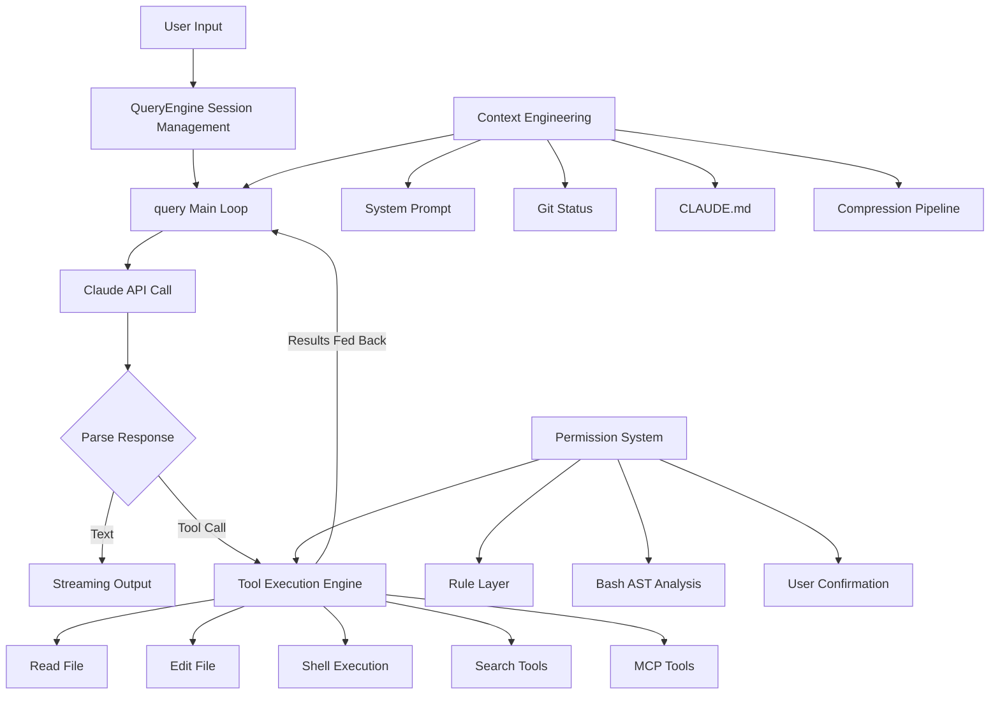

# How Claude Code Works

**An In-Depth Analysis of the Source Code Architecture of the Most Successful AI Coding Agent**

> Want to build one yourself? Check out the companion project **[Claude Code From Scratch](https://github.com/Windy3f3f3f3f/claude-code-from-scratch)** — ~3000 lines of TypeScript, 11 step-by-step tutorial chapters, build your own Claude Code from scratch

---

Claude Code is the most widely used AI coding Agent today, and in our opinion the best AI coding tool available. It can understand entire code repositories, autonomously execute multi-step programming tasks, and safely run commands — all powered by the engineering wisdom distilled in **500,000+ lines of TypeScript source code**.

Anthropic open-sourced (sort of) this source code. **But with 500,000 lines of code, where do you even start reading?**

This is why we created this project. We both faced the same problem of not being able to read such a massive codebase, and our solution was to read it together with Claude Code, having it write documentation to help us understand the source code. At the same time, we wanted to document this process, which resulted in this project.

Together with Claude Code, working overtime, we distilled **15 topic-specific documents** from the source code, covering every key design decision from the core loop to security defenses. Whether you want to build your own AI Agent or want to understand and use Claude Code more deeply, this is the shortest path (probably? Even if it's not the shortest, we'll keep updating this project).

## System Architecture

## Why Is This Source Code Worth Studying In Depth?

Most AI Agent frameworks are "demo-level" — they declare success after getting one scenario to work. Claude Code is different. It's a **production system used daily by millions of developers**, dealing with problems far more complex than any demo:

- When conversations reach millions of tokens and the context window isn't enough, what do you do? (How memory management and compression schemes are designed — super important)
- With 66 built-in tools existing simultaneously, how do you coordinate them? (If all tool contexts are given to the AI, it would directly explode)
- How do you make the user feel it's "fast", even though model inference itself takes tens of seconds? (How to implement pipeline design)
- When a user tells the AI to execute `rm -rf /`, how do you stop it? (Safety guardrails are critical)

The solutions to these problems are hidden in the source code.

## Key Designs Discovered from the Source Code

> The following content all comes from actual analysis of the source code, not speculation.

### Why Does Claude Code Feel So Fast to Use?

It actually does three clever things:

1. **Full-pipeline streaming output** — Instead of waiting for the model to finish thinking before displaying, it shows each token immediately as it's generated. The entire pipeline from API calls to terminal rendering is streaming.
2. **Tool pre-execution** — When the model says "I want to read a certain file", that file is actually already being read. The system starts parsing and executing tool calls while the model is still outputting, using the 5-30 second window of model generation to hide the ~1 second tool latency.
3. **9-stage parallel startup** — Unrelated initialization tasks are executed in parallel during startup, compressing the critical path to approximately 235ms.

### What Happens When Things Go Wrong? — Silent Recovery

Ordinary programs show errors to users when they encounter them. Claude Code's strategy is: **For recoverable errors, the user never sees them at all.**

For example, when a conversation gets too long and exceeds the context window, it doesn't pop up an error dialog asking you to handle it manually. Instead, it quietly compresses the context and automatically retries. Output tokens hit the limit? Automatically upgrades from 4K to 64K and retries. The entire Agent loop has 7 different "continue" strategies, each corresponding to a different failure recovery path.

This is why you rarely encounter errors when using Claude Code — it's not that there are no errors, but rather that most of them are digested internally.

### What About Conversations That Are Too Long? — 4-Level Progressive Compression

This is one of the most elegant designs in the entire system. When the context is about to exceed its limit, instead of compressing everything in one shot, it processes in 4 levels progressively:

1. **Trimming** — First, truncate large content blocks (old tool outputs) from historical messages
2. **Deduplication** — Remove duplicate content at nearly zero cost
3. **Folding** — Fold inactive conversation segments, but without modifying the original content (can be unfolded to restore)
4. **Summarization** — As a last resort, launch a sub-Agent to summarize the entire conversation

Each level may release enough space so that subsequent levels don't need to execute. Moreover, after compression, the system **automatically restores the content of the 5 most recently edited files**, preventing the model from forgetting what it was just working on.

### How to Prevent AI from Executing Dangerous Operations? — 5-Layer Defense in Depth

Claude Code lets AI run commands directly on your computer, so the security design must be rock-solid. Instead of relying on a single "Are you sure?" dialog, it builds a 5-layer defense system:

1. **Permission modes** — Different trust levels that limit the scope of executable operations
2. **Rule matching** — Whitelist/blacklist based on command patterns
3. **Bash command deep analysis** — This is the hardest part: using syntax tree analysis (not regex matching) to dissect the true intent of Shell commands, including 23 security checks covering command injection, environment variable leakage, special character attacks, etc.
4. **User confirmation** — Dangerous operations trigger a confirmation dialog, but with 200ms debounce protection to prevent accidental confirmation from rapid keystrokes
5. **Hook validation** — Allows users to define custom security rules, and can even dynamically modify tool input parameters (e.g., automatically adding `--dry-run` to `rm`)

If any of these five layers blocks it, the operation won't execute. Defense in depth.

### How Do 66 Tools Work Together?

All tools — reading files, writing files, running commands, searching, even third-party MCP tools — follow **the same interface specification**. This means:

- Third-party tools and built-in tools go through the exact same execution pipeline, enjoying the same security checks and permission controls
- Read-only tools automatically execute in parallel, write operations automatically serialize, no need to manually manage concurrency
- When tool output exceeds 100K characters, it's automatically saved to disk; the model only gets a summary and file path, reading the full content when needed

### How Do Multiple Agents Collaborate?

Claude Code supports three multi-Agent modes:

- **Sub-Agent** — The main Agent dispatches tasks to sub-Agents and waits for results to return
- **Coordinator** — Pure commander mode, the coordinator can only assign tasks, **cannot read files or write code itself**, enforcing division of labor
- **Swarm** — Multiple named Agents communicate point-to-point, each working independently

To prevent conflicts from multiple Agents modifying the same file simultaneously, the system uses Git Worktree to give each Agent an independent copy of the code.

## Deep Dive Topics

| # | Document | What You'll Learn |
|---|----------|-------------------|
| 1 | [Overview](/en/docs/01-overview.md) | Thinking behind technology choices (why Bun/React/Zod), 6 core design principles, 9-stage 235ms startup process, complete data flow panorama |
| 2 | [Agent Loop](/en/docs/02-agent-loop.md) | Dual-layer architecture of the Agent loop, 7 Continue Sites for failure recovery, tool pre-execution, StreamingToolExecutor concurrency mechanism |
| 3 | [Context Engineering](/en/docs/03-context-engineering.md) | Complete details of the 4-level compression pipeline, post-compression auto-recovery mechanism (5 files + skill reactivation), prompt caching strategy and cache break detection |
| 4 | [Tool System](/en/docs/04-tool-system.md) | Registration and concurrency control for 66 tools, detailed MCP 7 transport types, connection state machine, OAuth 2.0 + PKCE authentication flow |
| 5 | [Skills System](/en/docs/09-skills-system.md) | 6-layer skill sources and priority, lazy loading and token budget allocation, Inline/Fork dual execution modes, whitelist permission model, skill retention after compression |
| 6 | [Memory System](/en/docs/08-memory-system.md) | 4 memory types and closed taxonomy, Sonnet semantic recall and async prefetch, background memory extraction Agent, memory drift defense, team memory |
| 7 | [Hooks & Extensibility](/en/docs/06-hooks-extensibility.md) | Complete 23+ Hook events panorama, 5 Hook types, 6-stage execution pipeline, PermissionRequest 4 capabilities, trust model and security |
| 8 | [Multi-Agent Architecture](/en/docs/07-multi-agent.md) | Sub-Agent 4 execution modes and Worktree isolation, coordinator pure orchestration design, Swarm 3 execution backends and mailbox communication |
| 9 | [Plan Mode](/en/docs/10-plan-mode.md) | Two entry paths, 5-phase and iterative dual workflows, attachment throttling mechanism, Phase 4 four experimental variants, plan file management and recovery, approval and permission restoration |
| 10 | [Code Editing Strategy](/en/docs/05-code-editing-strategy.md) | Why search-and-replace is better than full file rewrite, uniqueness constraints and anti-hallucination design, code-level implementation of mandatory pre-edit reading |
| 11 | [Task Management System](/en/docs/15-task-system.md) | File-level storage with concurrency locking, 3-layer change detection, dependency tracking and atomic claiming, multi-agent task coordination, verification nudge |
| 12 | [Permissions & Security](/en/docs/11-permission-security.md) | 5-layer defense-in-depth system, tree-sitter AST analysis + 23 security checks, race confirmation mechanism and 200ms anti-misclick |
| 13 | [System Prompt Design](/en/docs/14-system-prompt-design.md) | 7-layer progressive prompt architecture, anti-pattern inoculation, blast radius risk framework, 7 agent prompt design principles |
| 14 | [User Experience Design](/en/docs/12-user-experience.md) | Custom Ink renderer architecture, Yoga Flexbox layout, virtual scrolling and object pool optimization, Vim mode |
| 15 | [Minimal Essential Components](/en/docs/13-minimal-components.md) | 7 minimal essential component framework, item-by-item comparison of minimal vs production implementation, evolution path from 500 lines to 500,000 lines |
| 16 | [Observability: Metrics & Traces](/en/docs/16-observability.md) | The EXPLAIN of a prompt, three observability planes + transcript substrate, the prompt.id join key, an OTel metric/event/span walkthrough, cost accounting, permission decision logging, privacy boundaries |
| 17 🔍 | [Autonomy & Continuation: `/goal` and `/loop`](/en/docs/17-autonomy-goal-loop.md) | **Post-snapshot · black-box RE**: the two paradigms of autonomy (a gatekeeping evaluator vs a self-scheduling alarm), the `/goal` evaluator's full system prompt and its `impossible` loop-brake, `/loop`'s parsing rules and the cron / ScheduleWakeup execution paths, with a reproducible reverse-engineering method in the appendix |
| 18 🔍 | [Auto Mode: Permissions Enter the Classifier Era](/en/docs/18-auto-mode.md) | **Post-snapshot · source + capture**: permissions evolve from "rules + confirmation dialogs" to an ML classifier adjudicating each action, four natural-language rule buckets, a two-stage (coarse screen → fine judgment) classifier, the reasoning-blind "the accused can't argue its own case", how it understands "don't push", brakes and degradation; with the classifier's full system prompt and a reproducible RE method in the appendix |

## Who Should Read This?

| You Are | What You'll Get |
|---------|----------------|
| A developer who wants to build AI Agent products | An architecture reference validated by millions of users, helping you avoid detours |
| A Claude Code user | Understanding why it works this way, learning to deeply customize with Hooks and CLAUDE.md |
| Someone interested in AI safety | Practical security design for production AI systems, not just theories in papers |
| A student or AI researcher | First-hand material on large-scale engineering practices, more real than any textbook |

## Key Metrics

| Metric | Value |
|--------|-------|
| Total source code lines | 512,000+ |
| TypeScript files | 1,884 |
| Built-in tools | 66+ |
| Compression pipeline levels | 4 |
| Permission defense layers | 5 |

## Reading Recommendations

**Only have 10 minutes?**
→ Read [Quick Start](/en/docs/quick-start.md)

**Want to understand core principles?**
→ Read in order: [Agent Loop](/en/docs/02-agent-loop.md) → [Context Engineering](/en/docs/03-context-engineering.md) → [Tool System](/en/docs/04-tool-system.md)

**Want to build your own AI Agent?**
→ First read [Minimal Essential Components](/en/docs/13-minimal-components.md), then follow the 11-chapter tutorial in **[claude-code-from-scratch](https://github.com/Windy3f3f3f3f/claude-code-from-scratch)** to build it hands-on — ~3000 lines of code, each step explained against the source code

**Want to customize Claude Code?**
→ Read [Hooks & Extensibility](/en/docs/06-hooks-extensibility.md) + [Memory System](/en/docs/08-memory-system.md) + [Skills System](/en/docs/09-skills-system.md)

**Concerned about security?**
→ Read [Permissions & Security](/en/docs/11-permission-security.md) + [Code Editing Strategy](/en/docs/05-code-editing-strategy.md)

## Roadmap / TODO

Our analysis is based on a source snapshot of roughly **v2.1.6x (late March 2026)**. Since then Claude Code has shipped ~130 more releases with major capabilities that don't exist in the snapshot. There is **no leaked source to walk through** for these, so we plan to analyze them differently — **black-box testing + open-source intelligence** (official changelog, official docs, public posts): use the latest builds hands-on, observe behavior, boundaries and failure modes, then cross-check against official material to reason about how they likely work (inference will be clearly separated from evidence).

Planned topics:

- [x] **Observability: Metrics & Trace** (proposed in [#10](https://github.com/Windy3f3f3f3f/how-claude-code-works/issues/10)) — how Claude Code instruments itself: OpenTelemetry metrics/events export, cost accounting, session transcripts as turn-level traces. **Done → [Chapter 16: Observability](/en/docs/16-observability.md)**
- [x] **The autonomy loop: `/goal`, `/loop` and cron scheduling** (v2.1.71 / v2.1.139) — set a completion condition and Claude keeps working across turns until it's met; recurring tasks on fixed or model-chosen intervals. **Done → [Chapter 17: Autonomy & Continuation](/en/docs/17-autonomy-goal-loop.md)** (includes the full prompt text of the `/goal` evaluator and the `/loop` command + a reproducible RE method)
- [ ] **Dynamic Workflows (trigger word "ultracode")** (v2.1.154–160) — an orchestration script that directs tens to hundreds of agents in the background, with token budgets, resumable runs and the `/workflows` panel
- [x] **Auto Mode: permissions enter the classifier era** (opt-in dropped in v2.1.152) — from "rules + confirmation dialogs" to an ML classifier deciding allow/deny per action, honoring spoken boundaries like "don't push". **Done → [Chapter 18: Auto Mode](/en/docs/18-auto-mode.md)** (includes the classifier's full system prompt + the four rule buckets + a reproducible RE method)
- [ ] **The background agent fleet** (v2.1.139–198) — `/bg`, a resident daemon, the global `claude agents` view, retire→wake lifecycle, auto commit+push+draft-PR on completion, subagents running in the background by default
- [ ] **Cloud multi-agent review** (v2.1.111–147) — `/ultrareview` → `/code-review`: parallel multi-agent analysis with adversarial critique, effort levels (low→ultra) and CI integration
- [ ] **Agent Teams & cross-session security** (v2.1.166–178) — team collaboration via `SendMessage`; the anti-prompt-injection design where cross-session messages carry no user authority

> Vote or suggest topics in [issues](https://github.com/Windy3f3f3f3f/how-claude-code-works/issues).

## Contributors

|  |  |  |  |
|:---:|:---:|:---:|:---:|
| [@Windy3f3f3f3f](https://github.com/Windy3f3f3f3f) | [@davidweidawang](https://github.com/davidweidawang) | [Kaibo Huang](https://scholar.google.com/citations?user=C7B5X5IAAAAJ&hl=zh-CN) | [@longx24](https://github.com/longx24) |

## Changelog

| Date | Changes |
|------|---------|
| 2026-04-09 | Comprehensive review and fix of all 13 chapters: corrected inaccurate numbers/references (line counts, percentages, event counts, chapter numbering), added high-level overviews to chapters that lacked them, restructured sections for better readability (ch05 split/swap, ch08 reorder/merge), synchronized Chinese and English versions |
| 2026-04-03 | Added Chapter 14: System Prompt Design Philosophy, in-depth analysis of prompt content design principles and engineering practices |
| 2026-04-03 | Added dark mode, reading progress bar, back-to-top button, context-aware language switching, and other UI improvements |
| 2026-04-03 | Completed English translations for all 13 documents, supporting bilingual Chinese-English switching |
| 2026-04-01 | Split Memory & Skills into separate chapters (11→12 articles), renumbered 01-12 by sidebar grouping |
| 2026-04-01 | Major expansion of all 12 chapters (doubled in length), added source-level implementation details, Mermaid architecture diagrams, and code examples |
| 2026-03-31 | Added 3 chapters: Hooks & Extensibility, Multi-Agent Architecture, Memory & Skills System |
| 2026-03-31 | Launched Docsify documentation site with search, Mermaid rendering, and chapter navigation |
| 2026-03-31 | Initial release: 8 core architecture analysis documents |

## License

MIT
